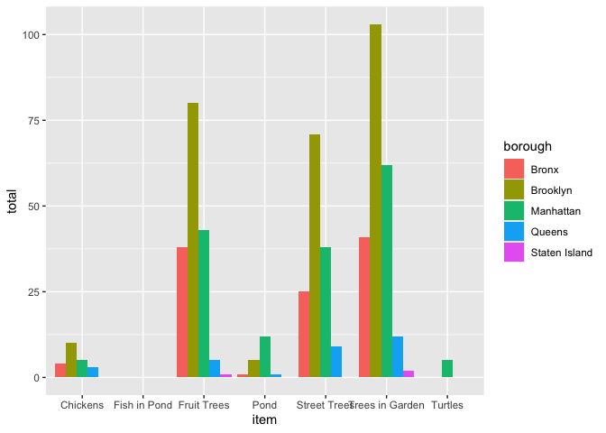

Final Project Code
================
Kaylin De Silva, Alishah Khan, Cristina Varela
12-06-2024

\#loading libraries

``` r
library(tidyverse)
```

    ## ── Attaching core tidyverse packages ──────────────────────── tidyverse 2.0.0 ──
    ## ✔ dplyr     1.1.4     ✔ readr     2.1.5
    ## ✔ forcats   1.0.0     ✔ stringr   1.5.1
    ## ✔ ggplot2   3.5.1     ✔ tibble    3.2.1
    ## ✔ lubridate 1.9.3     ✔ tidyr     1.3.1
    ## ✔ purrr     1.0.2     
    ## ── Conflicts ────────────────────────────────────────── tidyverse_conflicts() ──
    ## ✖ dplyr::filter() masks stats::filter()
    ## ✖ dplyr::lag()    masks stats::lag()
    ## ℹ Use the conflicted package (<http://conflicted.r-lib.org/>) to force all conflicts to become errors

``` r
library(rvest)
```

    ## 
    ## Attaching package: 'rvest'
    ## 
    ## The following object is masked from 'package:readr':
    ## 
    ##     guess_encoding

``` r
library(httr)
```

\#loading datasets

``` r
garden_info = 
  GET("http://data.cityofnewyork.us/resource/p78i-pat6.csv") |> 
  content("parsed") |>
  janitor::clean_names() |>
  drop_na() |>
   mutate(
    borough = 
      recode(
        borough,
        "B" = "Brooklyn",
        "M" = "Manhattan",
        "X" = "Bronx",
        "R" = "Staten Island",
        "Q" = "Queens"
      )
   )
```

    ## Rows: 629 Columns: 27
    ## ── Column specification ────────────────────────────────────────────────────────
    ## Delimiter: ","
    ## chr (16): address, borough, gardenname, juris, multipolygon, openhrsf, openh...
    ## dbl (11): assemblydist, communityboard, congressionaldist, coundist, policep...
    ## 
    ## ℹ Use `spec()` to retrieve the full column specification for this data.
    ## ℹ Specify the column types or set `show_col_types = FALSE` to quiet this message.

``` r
site_visits = 
  GET("http://data.cityofnewyork.us/resource/xqbk-beh5.csv") |>
  content("parsed") |>
  janitor::clean_names()
```

    ## Rows: 357 Columns: 35
    ## ── Column specification ────────────────────────────────────────────────────────
    ## Delimiter: ","
    ## chr  (1): parksid
    ## dbl  (5): inspectionid, totalfencelength, totalsidewalkarea, totalsidewalkle...
    ## lgl (29): nexttoanothergarden, onsiteservice, hydrantw_in15ft, hydrantongard...
    ## 
    ## ℹ Use `spec()` to retrieve the full column specification for this data.
    ## ℹ Specify the column types or set `show_col_types = FALSE` to quiet this message.

\#merging the data sets for flora and fauna analysis

``` r
#cleaning site visit data set so it only includes variables involved in flora and fauna 
site_visits_flora_fauna = site_visits |>
  select(parksid, inspectionid, treesingarden, fruittrees, streettrees, chickens, pond, fishinpond, turtles) |>
 mutate_at(c('treesingarden', 'fruittrees', 'streettrees', 'chickens', 'pond', 'fishinpond', 'turtles'), as.numeric)

flora_fauna_df= 
  inner_join(garden_info, site_visits_flora_fauna, by = "parksid") 
```

``` r
flora_fauna_df = flora_fauna_df |>
  group_by(borough) |>
  mutate(
  "Trees in Garden" = sum(treesingarden),
  "Fruit Trees" = sum(fruittrees),
  "Street Trees" = sum(streettrees),
  "Chickens" = sum(chickens),
  "Pond" = sum(pond),
  "Fish in Pond" = sum(fishinpond),
  "Turtles" = sum(turtles)
  )
```

``` r
flora_fauna_tidy = 
   pivot_longer(
    flora_fauna_df, 
    "Trees in Garden":"Turtles",
    names_to = "item", 
    values_to = "total")

ggplot(flora_fauna_tidy, aes(x = item, y= total, fill=borough)) + 
    geom_bar(position="dodge", stat="identity")
```

    ## Warning: Removed 236 rows containing missing values or values outside the scale range
    ## (`geom_bar()`).

<!-- -->
